# 🎯 HYPERBOX MASTER ACTION PLAN

## Autonomous Development Roadmap for Maximum Automation

**Version:** 1.0  
**Strategy:** Maximize agent autonomy through clear task definitions  
**Target:** Complete working HyperBox v0.1.0 Alpha

---

## 📋 TABLE OF CONTENTS

1. [Execution Philosophy](#-execution-philosophy)
2. [Priority Matrix](#-priority-matrix)
3. [Phase 2A: Core Runtime](#-phase-2a-core-runtime-completion)
4. [Phase 2B: Container Operations](#-phase-2b-container-operations)
5. [Phase 3: Project Isolation](#-phase-3-project-isolation-completion)
6. [Phase 4: Optimizations](#-phase-4-optimizations-completion)
7. [Phase 5: Desktop App](#-phase-5-desktop-app-completion)
8. [Validation & Release](#-validation--release)
9. [Autonomous Task Queue](#-autonomous-task-queue)

---

## 🧠 EXECUTION PHILOSOPHY

### Autonomy Principles

```
┌─────────────────────────────────────────────────────────────────┐
│  AUTONOMOUS EXECUTION RULES                                      │
├─────────────────────────────────────────────────────────────────┤
│  1. Each task is self-contained with clear acceptance criteria  │
│  2. Dependencies are explicitly stated                          │
│  3. Validation commands are provided for each task              │
│  4. Agent can execute tasks in sequence without human input     │
│  5. Blockers trigger escalation path, not full stop             │
└─────────────────────────────────────────────────────────────────┘
```

### Agent Assignment Protocol

| Agent      | Domain              | Tasks                                  |
| ---------- | ------------------- | -------------------------------------- |
| @APEX      | Core Implementation | Runtime integration, container ops     |
| @VELOCITY  | Performance         | Optimizations, benchmarks              |
| @FLUX      | DevOps              | CI/CD enhancements, deployment         |
| @CIPHER    | Security            | Isolation, seccomp, namespace security |
| @SYNAPSE   | Integration         | API design, IPC protocols              |
| @ECLIPSE   | Testing             | Test coverage, E2E tests               |
| @ARCHITECT | Design              | Architecture decisions                 |

---

## 📊 PRIORITY MATRIX

### Critical Path (Must Complete for Alpha)

```mermaid
graph LR
    A[crun Integration] --> B[Container Create/Start]
    B --> C[Daemon IPC]
    C --> D[CLI ↔ Daemon]
    D --> E[Basic GUI]
    E --> F[Alpha Release]
```



### Priority Levels

| Level | Description                          | Tasks                             |
| ----- | ------------------------------------ | --------------------------------- |
| P0    | **BLOCKER** - Cannot proceed without | crun integration, daemon IPC      |
| P1    | **CRITICAL** - Alpha release         | Container CRUD, project detection |
| P2    | **IMPORTANT** - Beta release         | CRIU, eStargz, ML prewarming      |
| P3    | **NICE-TO-HAVE** - v1.0 release      | Advanced features, polishing      |

---

## 🔧 PHASE 2A: CORE RUNTIME COMPLETION

### Task 2A.1: Install and Configure crun Binary

**Priority:** P0 | **Agent:** @APEX | **Est. Time:** 2h

**Objective:** Ensure crun binary is available and callable

**Steps:**

```bash
# Windows (via WSL2)
wsl --install Ubuntu
wsl -d Ubuntu -e bash -c "sudo apt update && sudo apt install -y crun"

# Linux
sudo apt install crun  # or build from source

# Verify
crun --version
```

**Acceptance Criteria:**

- [ ] `crun --version` returns valid version
- [ ] HyperBox can locate crun binary
- [ ] Test: `cargo test -p hyperbox-core test_crun_binary_exists`

**Automation Hook:**

```rust
// Add to hyperbox-core/src/runtime/crun.rs
#[cfg(test)]
mod tests {
    #[test]
    fn test_crun_available() {
        let runtime = CrunRuntime::new(RuntimeConfig::default()).await;
        assert!(runtime.is_available().await);
    }
}
```

---

### Task 2A.2: Implement Real Container Creation

**Priority:** P0 | **Agent:** @APEX | **Est. Time:** 4h

**Objective:** Create actual OCI containers via crun

**File:** `crates/hyperbox-core/src/runtime/crun.rs`

**Implementation Checklist:**

```rust
// Complete these methods:
impl ContainerRuntime for CrunRuntime {
    async fn create(&self, spec: ContainerSpec) -> Result<ContainerId> {
        // 1. Generate OCI bundle
        let bundle = self.generate_bundle(&spec).await?;

        // 2. Call crun create
        self.run_crun(&["create", "--bundle", bundle.to_str()?, &spec.id]).await?;

        // 3. Return container ID
        Ok(ContainerId::new(spec.id))
    }

    async fn start(&self, id: &ContainerId) -> Result<()> {
        self.run_crun(&["start", id.as_str()]).await?;
        Ok(())
    }

    async fn stop(&self, id: &ContainerId, timeout: Duration) -> Result<()> {
        self.run_crun(&["kill", id.as_str(), "SIGTERM"]).await?;
        tokio::time::sleep(timeout).await;
        self.run_crun(&["delete", "--force", id.as_str()]).await?;
        Ok(())
    }
}
```

**Acceptance Criteria:**

- [ ] Can create a container from alpine image
- [ ] Container shows in `crun list`
- [ ] Container can be started and stopped
- [ ] Test: `cargo test -p hyperbox-core test_container_lifecycle`

**Validation Command:**

```bash
cargo test -p hyperbox-core container -- --nocapture
```

---

### Task 2A.3: Implement Image Pulling via Bollard

**Priority:** P0 | **Agent:** @APEX | **Est. Time:** 3h

**Objective:** Pull container images from registries

**File:** `crates/hyperbox-core/src/storage/registry.rs`

**Implementation:**

```rust
use bollard::Docker;
use bollard::image::CreateImageOptions;

pub struct ImageRegistry {
    docker: Docker,  // Use bollard for compatibility
}

impl ImageRegistry {
    pub async fn pull(&self, image: &str, tag: &str) -> Result<()> {
        let options = CreateImageOptions {
            from_image: image,
            tag,
            ..Default::default()
        };

        let mut stream = self.docker.create_image(Some(options), None, None);
        while let Some(result) = stream.next().await {
            match result {
                Ok(info) => debug!("Pull progress: {:?}", info),
                Err(e) => return Err(e.into()),
            }
        }
        Ok(())
    }
}
```

**Acceptance Criteria:**

- [ ] `hb image pull alpine:latest` works
- [ ] Image stored in local cache
- [ ] Progress reported during pull

---

### Task 2A.4: Implement cgroups v2 Integration

**Priority:** P1 | **Agent:** @CIPHER | **Est. Time:** 4h

**Objective:** Real resource isolation via cgroups

**File:** `crates/hyperbox-core/src/isolation/cgroups.rs`

**Implementation:**

```rust
pub struct CgroupManager {
    cgroup_path: PathBuf,
    controllers: HashSet<String>,
}

impl CgroupManager {
    pub async fn create(&self, name: &str, limits: &ResourceLimits) -> Result<()> {
        let cgroup_dir = self.cgroup_path.join(name);
        fs::create_dir_all(&cgroup_dir).await?;

        // Set memory limit
        if let Some(memory) = limits.memory_bytes {
            fs::write(cgroup_dir.join("memory.max"), memory.to_string()).await?;
        }

        // Set CPU limit
        if let Some(cpu) = limits.cpu_millicores {
            let quota = cpu * 1000;  // microseconds
            fs::write(cgroup_dir.join("cpu.max"), format!("{} 100000", quota)).await?;
        }

        Ok(())
    }
}
```

**Acceptance Criteria:**

- [ ] Cgroup created in `/sys/fs/cgroup/hyperbox/`
- [ ] Memory limits enforced
- [ ] CPU limits enforced
- [ ] Test: `cargo test -p hyperbox-core test_cgroup_limits`

---

## 🔧 PHASE 2B: CONTAINER OPERATIONS

### Task 2B.1: Implement Daemon IPC Protocol

**Priority:** P0 | **Agent:** @SYNAPSE | **Est. Time:** 4h

**Objective:** Enable CLI and GUI to communicate with daemon

**Files:**

- `crates/hyperbox-daemon/src/ipc.rs`
- `crates/hyperbox-daemon/src/api.rs`

**Protocol Design:**

```rust
// Using Unix sockets (Linux) / Named pipes (Windows)
pub struct IpcServer {
    #[cfg(unix)]
    socket: tokio::net::UnixListener,
    #[cfg(windows)]
    pipe: tokio::net::windows::named_pipe::NamedPipeServer,
}

// Message format (JSON-RPC 2.0)
#[derive(Serialize, Deserialize)]
pub struct IpcRequest {
    pub jsonrpc: String,  // "2.0"
    pub method: String,   // "container.create", "container.start", etc.
    pub params: Value,
    pub id: u64,
}

#[derive(Serialize, Deserialize)]
pub struct IpcResponse {
    pub jsonrpc: String,
    pub result: Option<Value>,
    pub error: Option<IpcError>,
    pub id: u64,
}
```

**Acceptance Criteria:**

- [ ] Daemon listens on Unix socket / named pipe
- [ ] CLI can send requests and receive responses
- [ ] Error handling for daemon not running

**Validation:**

```bash
# Start daemon
cargo run -p hyperbox-daemon &

# Test IPC
echo '{"jsonrpc":"2.0","method":"system.info","params":{},"id":1}' | nc -U /tmp/hyperbox.sock
```

---

### Task 2B.2: Wire CLI to Daemon

**Priority:** P0 | **Agent:** @APEX | **Est. Time:** 3h

**Objective:** CLI commands call daemon via IPC

**File:** `crates/hyperbox-cli/src/commands/container.rs`

**Implementation:**

```rust
pub async fn run(args: RunArgs) -> Result<()> {
    let client = IpcClient::connect().await?;

    let response = client.call("container.run", json!({
        "image": args.image,
        "name": args.name,
        "command": args.command,
    })).await?;

    println!("Container started: {}", response["id"]);
    Ok(())
}
```

**Acceptance Criteria:**

- [ ] `hb container run alpine echo hello` creates container via daemon
- [ ] `hb container ls` lists containers from daemon
- [ ] `hb container stop <id>` stops container via daemon

---

### Task 2B.3: Container Logs Streaming

**Priority:** P1 | **Agent:** @APEX | **Est. Time:** 2h

**Objective:** Stream container logs to CLI/GUI

**Implementation:**

```rust
// In daemon
pub async fn stream_logs(id: &ContainerId, tx: mpsc::Sender<String>) -> Result<()> {
    let log_path = self.get_log_path(id)?;
    let file = tokio::fs::File::open(log_path).await?;
    let reader = BufReader::new(file);
    let mut lines = reader.lines();

    while let Some(line) = lines.next_line().await? {
        if tx.send(line).await.is_err() {
            break;  // Client disconnected
        }
    }
    Ok(())
}

// In CLI
pub async fn logs(args: LogsArgs) -> Result<()> {
    let client = IpcClient::connect().await?;
    let mut stream = client.stream("container.logs", json!({"id": args.id})).await?;

    while let Some(line) = stream.next().await {
        println!("{}", line);
    }
    Ok(())
}
```

**Acceptance Criteria:**

- [ ] `hb logs <container>` shows logs
- [ ] `hb logs -f <container>` follows logs in real-time

---

## 🔧 PHASE 3: PROJECT ISOLATION COMPLETION

### Task 3.1: Docker Compose Parser

**Priority:** P1 | **Agent:** @APEX | **Est. Time:** 4h

**Objective:** Parse docker-compose.yml files

**File:** `crates/hyperbox-project/src/detection.rs`

**Implementation:**

```rust
use serde_yaml;

pub struct DockerComposeParser;

impl DockerComposeParser {
    pub fn parse(path: &Path) -> Result<ProjectConfig> {
        let content = std::fs::read_to_string(path)?;
        let compose: ComposeFile = serde_yaml::from_str(&content)?;

        let mut containers = Vec::new();
        for (name, service) in compose.services {
            containers.push(ContainerConfig {
                name,
                image: service.image.unwrap_or_else(|| format!("{}_build", name)),
                ports: parse_ports(&service.ports.unwrap_or_default()),
                volumes: parse_volumes(&service.volumes.unwrap_or_default()),
                environment: service.environment.unwrap_or_default(),
                depends_on: service.depends_on.unwrap_or_default(),
            });
        }

        Ok(ProjectConfig { containers, ..Default::default() })
    }
}
```

**Acceptance Criteria:**

- [ ] Parses docker-compose.yml v3 format
- [ ] Extracts services, ports, volumes, environment
- [ ] Handles `depends_on` for startup order

---

### Task 3.2: Automatic Port Allocation

**Priority:** P1 | **Agent:** @APEX | **Est. Time:** 2h

**Objective:** No port conflicts between projects

**File:** `crates/hyperbox-project/src/ports.rs`

**Implementation:**

```rust
pub struct ProjectPortManager {
    allocated: DashMap<u16, ProjectId>,
    range: RangeInclusive<u16>,
}

impl ProjectPortManager {
    pub fn allocate(&self, project: ProjectId, preferred: Option<u16>) -> Result<u16> {
        // Try preferred port first
        if let Some(port) = preferred {
            if !self.allocated.contains_key(&port) {
                self.allocated.insert(port, project);
                return Ok(port);
            }
        }

        // Find next available in range
        for port in self.range.clone() {
            if !self.allocated.contains_key(&port) && !is_port_in_use(port) {
                self.allocated.insert(port, project);
                return Ok(port);
            }
        }

        Err(PortError::NoAvailablePorts)
    }
}
```

**Acceptance Criteria:**

- [ ] Ports allocated without conflicts
- [ ] Preferred ports respected when available
- [ ] Port reuse after project stops

---

### Task 3.3: Project Hot Reload Watcher

**Priority:** P2 | **Agent:** @APEX | **Est. Time:** 3h

**Objective:** Detect file changes and restart containers

**File:** `crates/hyperbox-project/src/watcher.rs`

**Implementation:**

```rust
use notify::{Watcher, RecursiveMode, watcher};

pub struct ProjectWatcher {
    watchers: DashMap<ProjectId, RecommendedWatcher>,
}

impl ProjectWatcher {
    pub async fn watch(&self, project: &Project, tx: mpsc::Sender<WatchEvent>) -> Result<()> {
        let (notify_tx, notify_rx) = std::sync::mpsc::channel();
        let mut watcher = watcher(notify_tx, Duration::from_millis(500))?;

        watcher.watch(&project.root, RecursiveMode::Recursive)?;

        // Spawn handler
        tokio::spawn(async move {
            for event in notify_rx {
                if let Ok(event) = event {
                    let _ = tx.send(WatchEvent::from(event)).await;
                }
            }
        });

        self.watchers.insert(project.id, watcher);
        Ok(())
    }
}
```

---

## 🔧 PHASE 4: OPTIMIZATIONS COMPLETION

### Task 4.1: CRIU Integration

**Priority:** P2 | **Agent:** @VELOCITY | **Est. Time:** 6h

**Objective:** <100ms container restore

**File:** `crates/hyperbox-optimize/src/criu.rs`

**Implementation Steps:**

1. Install CRIU: `sudo apt install criu`
2. Implement checkpoint:

```rust
pub async fn checkpoint(&self, pid: u32, options: &CriuOptions) -> Result<Checkpoint> {
    let criu_path = self.criu_path.as_ref().ok_or(CriuNotAvailable)?;

    let checkpoint_dir = self.checkpoint_dir.join(&container_id);
    fs::create_dir_all(&checkpoint_dir).await?;

    let mut cmd = Command::new(criu_path);
    cmd.args(&["dump", "-t", &pid.to_string(), "-D", checkpoint_dir.to_str()?]);

    if options.leave_running {
        cmd.arg("--leave-running");
    }

    cmd.status().await?;
    Ok(Checkpoint { path: checkpoint_dir, .. })
}
```

3. Implement restore:

```rust
pub async fn restore(&self, checkpoint: &Checkpoint) -> Result<u32> {
    let mut cmd = Command::new(self.criu_path.as_ref()?);
    cmd.args(&["restore", "-D", checkpoint.path.to_str()?]);

    let output = cmd.output().await?;
    // Parse PID from output
    Ok(parse_pid(&output.stdout)?)
}
```

**Acceptance Criteria:**

- [ ] Checkpoint creates restore files
- [ ] Restore completes in <100ms
- [ ] Process state preserved (memory, fds)

---

### Task 4.2: eStargz Lazy Loading

**Priority:** P2 | **Agent:** @VELOCITY | **Est. Time:** 5h

**Objective:** Fast image startup via lazy layer loading

**File:** `crates/hyperbox-optimize/src/lazy_load.rs`

**Implementation:**

```rust
pub struct LazyImageLoader {
    stargz_store: PathBuf,
}

impl LazyImageLoader {
    pub async fn mount_lazy(&self, image: &ImageRef) -> Result<PathBuf> {
        // Convert image to eStargz format if needed
        let stargz_layers = self.ensure_stargz(image).await?;

        // Mount with stargz-snapshotter
        let mount_point = self.stargz_store.join(image.digest());
        self.mount_stargz(&stargz_layers, &mount_point).await?;

        Ok(mount_point)
    }
}
```

---

### Task 4.3: ML-Based Pre-warming

**Priority:** P3 | **Agent:** @VELOCITY | **Est. Time:** 8h

**Objective:** Predict and pre-warm containers

**File:** `crates/hyperbox-optimize/src/predict.rs`

**Implementation:**

```rust
pub struct UsagePredictor {
    model: SimpleLinearModel,  // Start simple
    history: Vec<UsageEvent>,
}

impl UsagePredictor {
    pub fn predict_next_hour(&self) -> Vec<(String, f64)> {
        // Use time-of-day and day-of-week patterns
        let hour = chrono::Local::now().hour();
        let dow = chrono::Local::now().weekday();

        self.history.iter()
            .filter(|e| e.hour == hour && e.weekday == dow)
            .group_by(|e| &e.container_image)
            .map(|(image, events)| {
                let probability = events.len() as f64 / self.history.len() as f64;
                (image.clone(), probability)
            })
            .collect()
    }
}
```

---

## 🔧 PHASE 5: DESKTOP APP COMPLETION

### Task 5.1: Dashboard Real-Time Metrics

**Priority:** P1 | **Agent:** @APEX | **Est. Time:** 3h

**Objective:** Show live container stats

**File:** `app/src/pages/Dashboard.tsx`

**Implementation:**

```tsx
import { useEffect, useState } from "react";
import { invoke } from "@tauri-apps/api/core";

export default function Dashboard() {
    const [stats, setStats] = useState<SystemStats | null>(null);

    useEffect(() => {
        const interval = setInterval(async () => {
            const info = await invoke("get_system_info");
            setStats(info);
        }, 1000);

        return () => clearInterval(interval);
    }, []);

    return (
        <div className="grid grid-cols-4 gap-4">
            <MetricCard title="Containers" value={stats?.containers_running ?? 0} />
            <MetricCard title="CPU" value={`${stats?.cpu_percent ?? 0}%`} />
            <MetricCard title="Memory" value={formatBytes(stats?.memory_used ?? 0)} />
            <MetricCard title="Network" value={formatBytes(stats?.network_rx ?? 0)} />
        </div>
    );
}
```

---

### Task 5.2: Container Management UI

**Priority:** P1 | **Agent:** @APEX | **Est. Time:** 4h

**Objective:** Full container CRUD from GUI

**File:** `app/src/pages/Containers.tsx`

**Features:**

- [ ] List containers with status icons
- [ ] Start/Stop/Restart buttons
- [ ] Create container modal
- [ ] View logs panel
- [ ] Delete confirmation

---

### Task 5.3: Project Management UI

**Priority:** P1 | **Agent:** @APEX | **Est. Time:** 4h

**Objective:** Open and manage projects

**File:** `app/src/pages/Projects.tsx`

**Features:**

- [ ] Open folder dialog
- [ ] Auto-detect project type
- [ ] Start/Stop project
- [ ] View project containers
- [ ] Port mapping display

---

## ✅ VALIDATION & RELEASE

### Task V.1: E2E Test Suite

**Priority:** P1 | **Agent:** @ECLIPSE | **Est. Time:** 4h

**Objective:** Full end-to-end testing

**File:** `tests/e2e/`

**Tests:**

```rust
#[tokio::test]
async fn test_full_container_lifecycle() {
    // 1. Start daemon
    let daemon = start_daemon().await;

    // 2. Pull image
    run_cli(&["image", "pull", "alpine:latest"]).await?;

    // 3. Run container
    let output = run_cli(&["run", "-d", "alpine", "sleep", "30"]).await?;
    let id = parse_container_id(&output);

    // 4. Check running
    let list = run_cli(&["ps"]).await?;
    assert!(list.contains(&id));

    // 5. Stop container
    run_cli(&["stop", &id]).await?;

    // 6. Verify stopped
    let list = run_cli(&["ps", "-a"]).await?;
    assert!(list.contains("Exited"));

    // 7. Remove
    run_cli(&["rm", &id]).await?;
}
```

---

### Task V.2: Performance Benchmark Suite

**Priority:** P1 | **Agent:** @VELOCITY | **Est. Time:** 4h

**Objective:** Validate 20x performance target

**File:** `crates/hyperbox-optimize/benches/`

**Benchmarks:**

```rust
use criterion::{criterion_group, criterion_main, Criterion};

fn benchmark_container_start(c: &mut Criterion) {
    c.bench_function("cold_start", |b| {
        b.iter(|| {
            // Time from create to running
        })
    });

    c.bench_function("warm_start_criu", |b| {
        b.iter(|| {
            // Time to restore from checkpoint
        })
    });
}

criterion_group!(benches, benchmark_container_start);
criterion_main!(benches);
```

---

### Task V.3: Windows Compatibility Testing

**Priority:** P0 | **Agent:** @APEX | **Est. Time:** 4h

**Objective:** Ensure Windows works

**Checklist:**

- [ ] Named pipe IPC works
- [ ] Path handling (forward/back slashes)
- [ ] WSL2 integration
- [ ] Tauri app runs on Windows
- [ ] Installer builds correctly

---

## 📝 AUTONOMOUS TASK QUEUE

### Ready for Immediate Execution

Copy-paste these to execute autonomously:

```markdown
## TASK QUEUE (Execute in Order)

### 🔴 P0 - BLOCKERS (Do First)

1. [ ] Task 2A.1: Install crun binary
2. [ ] Task 2A.2: Implement container creation
3. [ ] Task 2A.3: Implement image pulling
4. [ ] Task 2B.1: Daemon IPC protocol
5. [ ] Task 2B.2: Wire CLI to daemon
6. [ ] Task V.3: Windows compatibility

### 🟠 P1 - CRITICAL (Alpha Release)

7. [ ] Task 2A.4: cgroups v2 integration
8. [ ] Task 2B.3: Container logs streaming
9. [ ] Task 3.1: Docker Compose parser
10. [ ] Task 3.2: Automatic port allocation
11. [ ] Task 5.1: Dashboard metrics
12. [ ] Task 5.2: Container management UI
13. [ ] Task 5.3: Project management UI
14. [ ] Task V.1: E2E test suite
15. [ ] Task V.2: Performance benchmarks

### 🟡 P2 - IMPORTANT (Beta Release)

16. [ ] Task 4.1: CRIU integration
17. [ ] Task 4.2: eStargz lazy loading
18. [ ] Task 3.3: Project hot reload

### 🟢 P3 - NICE-TO-HAVE (v1.0)

19. [ ] Task 4.3: ML pre-warming
20. [ ] Docker CLI compatibility layer
21. [ ] Auto-update system
```

---

## 🤖 AUTOMATION HOOKS

### CI/CD Enhancements

Add these to `.github/workflows/ci.yml`:

```yaml
benchmark:
    runs-on: ubuntu-latest
    steps:
        - uses: actions/checkout@v4
        - run: cargo bench --package hyperbox-optimize
        - uses: benchmark-action/github-action-benchmark@v1
          with:
              tool: "cargo"
              output-file-path: target/criterion/report.json
```

### Auto-Merge for Passing PRs

```yaml
auto-merge:
    if: github.event.pull_request.user.login == 'renovate[bot]'
    runs-on: ubuntu-latest
    steps:
        - uses: pascalgn/automerge-action@v0.15.6
          env:
              GITHUB_TOKEN: "${{ secrets.GITHUB_TOKEN }}"
              MERGE_METHOD: squash
```

---

## 📊 SUCCESS METRICS

### Alpha Release Criteria

- [ ] All P0 and P1 tasks complete
- [ ] 80%+ test coverage
- [ ] All CI checks passing
- [ ] Windows + Linux builds work
- [ ] Cold start <5 seconds measured

### Beta Release Criteria

- [ ] All P2 tasks complete
- [ ] CRIU restore <100ms
- [ ] Performance benchmarks documented
- [ ] Docker Compose v3 support

### v1.0 Release Criteria

- [ ] All tasks complete
- [ ] 20x Docker Desktop performance verified
- [ ] Production stability (1 week soak test)
- [ ] Documentation complete

---

_Generated by @NEXUS - Elite Agent Collective_
_Maximum Autonomy Action Plan v1.0_
